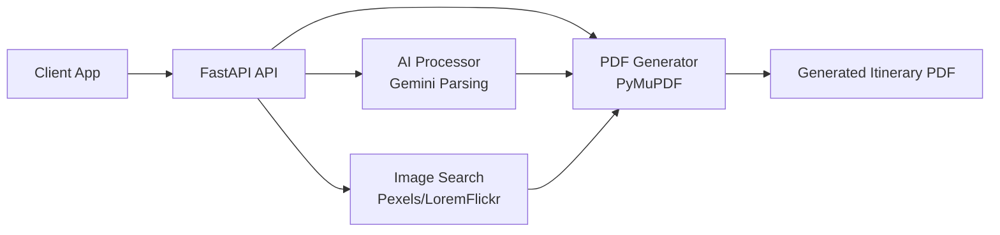
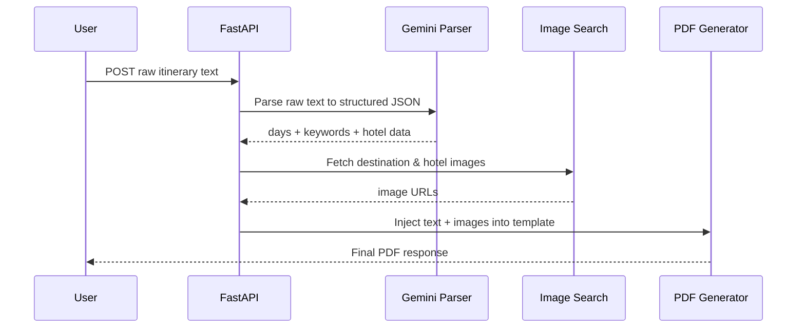

# Itinerary Generator Backend

FastAPI backend that turns structured or raw itinerary input into a styled multi-page travel PDF with destination images.

## Visual Architecture



## Request Flow (`/generate-from-raw`)



## Project Structure

```text
.
├── main.py            # FastAPI app and endpoints
├── ai_processor.py    # Gemini prompt + raw text parsing
├── image_search.py    # Pexels search with fallbacks
├── pdf_generator.py   # PDF layout rendering using PyMuPDF
├── templates/         # PDF template assets
└── requirements.txt   # Python dependencies
```

## API Endpoints

| Method | Endpoint | Purpose |
|---|---|---|
| POST | `/generate` | Generate PDF using provided `image_urls` and itinerary content |
| POST | `/generate-with-keywords` | Generate PDF after resolving `image_keywords` |
| POST | `/generate-from-raw` | Full pipeline: raw text → AI parsing → image fetch → PDF |

## Quick Start

### 1) Install

```bash
pip install -r requirements.txt
```

### 2) Run server

```bash
uvicorn main:app --reload
```

### 3) Open API docs

Visit: `http://127.0.0.1:8000/docs`

## Environment Variables

You can provide keys via `.env` or request headers:

- `GEMINI_API_KEY` (or `x-gemini-key` header)
- `PEXELS_API_KEY` (or `x-pexels-key` header)

If `PEXELS_API_KEY` is unavailable, image search falls back to LoremFlickr.